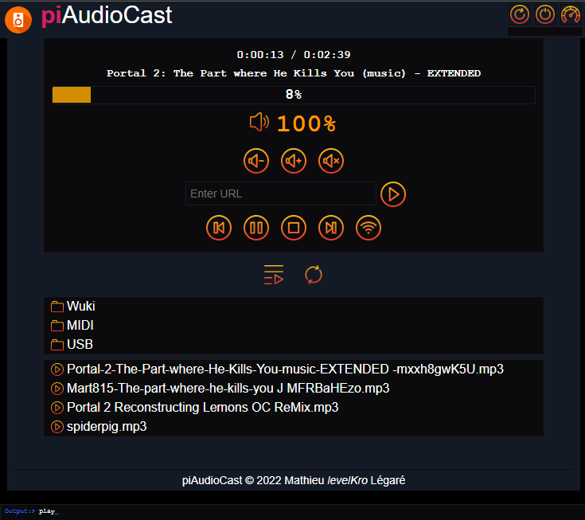

# piAudioCast

This project is for turn a Raspberry Pi into a small Audio Player controled by Web interface. Can support local files, usb files and Internet radio.



## Features

* Play audio file like WAV, MP3, AUD, M4A, WMA, MID, FLAC, OGG (suggest file extension if needed)
* Play Internet Radio over HTTP, like Shoutcast and Icecast
* Play all files in a folder (not sub directory, but planned)
* Web Interface with all controls
* Auto-install new Wifi configuration by USB drive
* Compatible with WM8960 hat
* Support button for volume loop
* Music folder available by Windows share (Samba)
* [planned] Random play
* [planned] Loop play
* [planned] Upload files

## Requirement

* Raspberry Pi (0/1/2/3/4)
* Raspbian OS Lite
* Local network (LAN or WLAN)
* Audio out (by HDMI or Speaker/Headphone, depend of your configuration)

## Install

Before installing the piAudioCast, install, if you need, your soundcard driver (when you use a Audio Hat). Follow guide from your hardware provider for this step.

When is done, open `raspi-config` and set the audio output on the jack/device do you want. Also set your hostname for easy contact your device on the network.

### Install requirements

```
cd /home/pi
sudo apt update
sudo apt upgrade -y
echo "** .. Install requirements"
sudo apt install -y git wget usbmount
sudo apt install -y python3-dev python3-pip samba espeak espeak-ng vlc python3-vlc python3-numpy
sudo pip3 install --upgrade pip setuptools wheel
sudo pip3 install numpy python-vlc psutil gpiozero
git clone https://github.com/levelKro/piaudiocast.git
mkdir /home/pi/music
```

### Autostart of piAudioCast

Edit the profile file.

`sudo nano  /home/pi/.profile` 

And add this line at the end.

`[[ -z $DISPLAY && $XDG_VTNR -eq 1 ]] && /home/pi/piaudiocast/cmd.sh start`

### Share of piAudioCast

Edit the Samba configuratile.

`sudo nano /etc/samba/smb.conf`

And add this lines at the end.

```
[home$]
   path = /home/pi
   force user = pi
   force group = pi
   guest ok = yes
   writable = yes
   read only = no
   browseable = yes

[music]
   path = /home/pi/music
   force user = pi
   force group = pi
   guest ok = yes
   writable = yes
   read only = no
   browseable = yes

```

The first share if for help of debugging of change settings. This is hidden and need to be entered manually for access it. The second share is where you put your music files.

### Adding USB Support

You need to create symbolic links into USB folder into the music folder. For do that, do this commands;

```
ln -s /media/usb0 /home/pi/music/USB/usb1
ln -s /media/usb1 /home/pi/music/USB/usb2
ln -s /media/usb2 /home/pi/music/USB/usb3
ln -s /media/usb3 /home/pi/music/USB/usb4
```

Please note: USBMOUNT can support up to 8 USB drives. You can limit or change the mount point by editing the USBMOUNT configuration. Please read the USBMOUNT manual for more details.
 
## Auto-install Wifi

Just put USB drive on your pi with the `wpa_supplicant.conf` file, configured like the Raspberry Pi requirement. The file was copied into `/boot` folder and the Raspberry will reboot.

## Boot and Poweroff

The script come with sound for help the user to known what the device do. One sound if when the system is started, another when do a power off or reboot or when the new Wifi file configuration was found. You can shutdown or reboot from the Web Interface.

## How to use

Just boot the device and wait, when you ear the boot sound, you can connect to Raspberry Pi IP address on normal HTTP port, like http://192.168.0.10 or http://piaudiocast (if `piaudiocast` is the hostname of your device).